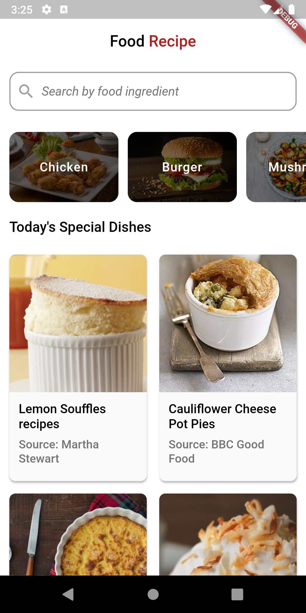
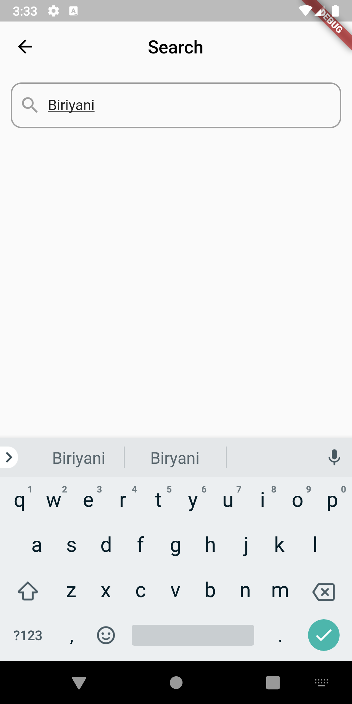
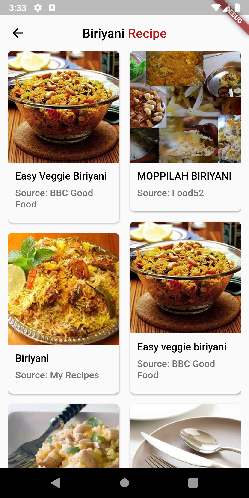

# Flutter Recipe

Simple food recipe application that fetches food recipes using [Edamam API](https://developer.edamam.com/).

## Overview:

Ths project has several features:
- `HomeScreen` contains special dishes fetched from the API in a `staggered_grid_view` manner.
- `HomeScreen` also contains some categories along with a `search bar` to search recipes using any ingredient.
- `CategoryScreen` shows 10 recipes based on the category chosen. 
- Dynamic theme

_Note: This project is made using Edamam API, to know more click [here](https://developer.edamam.com/)_

## Screenshots:

 
<table><tr>
 <td style="text-align: center">
 
 </td>
 <td style="text-align: center">
 
 </td>
 </tr></table>
 

    
 
<table><tr>
 <td style="text-align: center">
 
 </td>
 <td style="text-align: center">
 
 </td>
 </tr></table>
 

 
 ## Dependency used:
 
- [http](https://pub.dev/packages/http)
- [cached_network_image](https://pub.dev/packages/cached_network_image)
- [flutter_staggered_grid_view](https://pub.dev/packages/flutter_staggered_grid_view)

## TODO

- [ ] Create the `DetailsScreen` in a webview that will load a URL from the API and show inside the application

### If you like this repository then please give it a star ⭐

